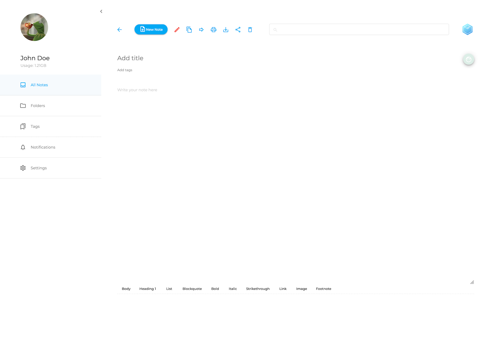
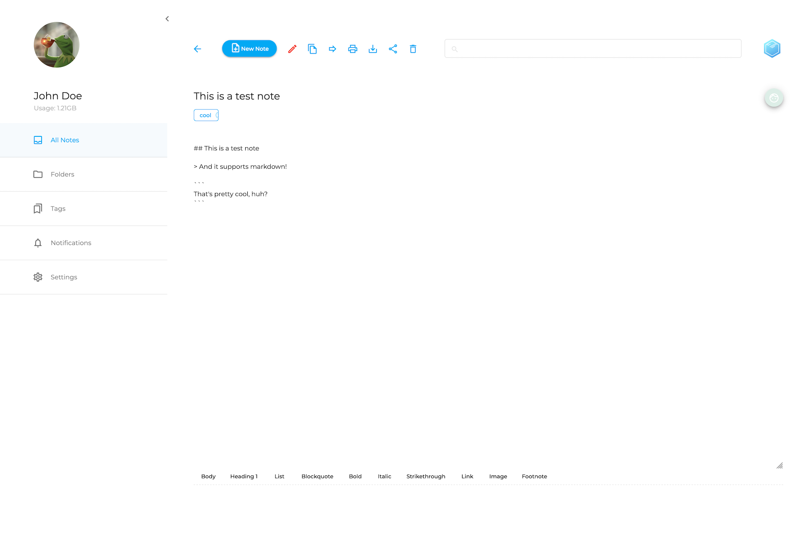
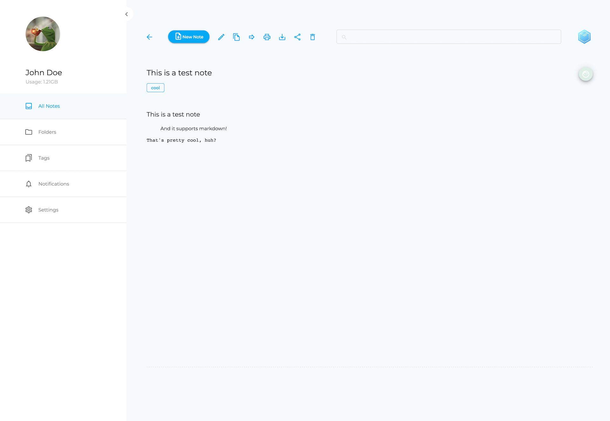
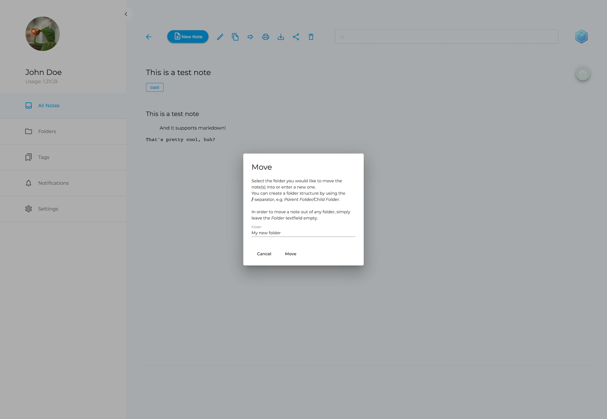
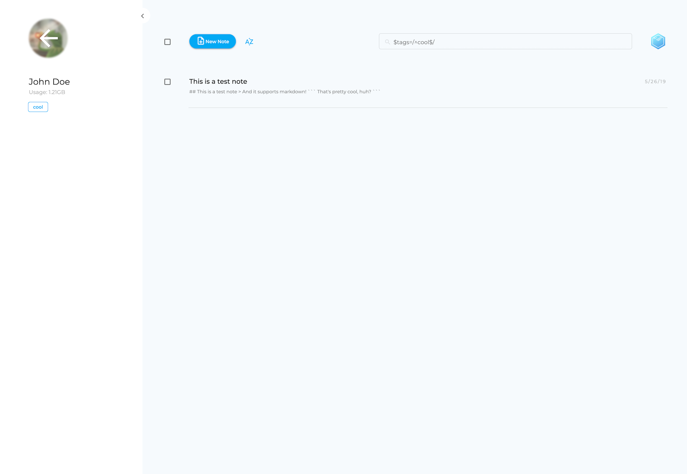

web
===

Paperwork Web UI

## General

This is a first try to build a web UI for Paperwork 2, based on Angular (7.x) and Material components.

## Getting involved

**Are you a front-end developer looking for a fun opensource project? I could use some help on this, [get in touch](mailto:marius@paperwork.cloud?subject=Paperwork%20Web%20UI)!**

## Current state

## Docker

### Environment Options

- `PAPERWORK_API_GATEWAY_PROTOCOL`: The protocol the front-end should communicate with the `service-gateway`, `http` or `https`.
- `PAPERWORK_API_GATEWAY_HOST_PORT`: The host/port combination under which the front-end can reach the `service-gateway`, e.g. `api.mydomain.com:8080`. If you're using a standard port (`80` for `http` and `443` for `https`) you can simply specify `api.mydomain.com` here.

## Development

### Prerequisites

In order to start development, you need to have the following tools installed:

- Node.js ([Mac](https://www.digitalocean.com/community/tutorials/how-to-install-node-js-and-create-a-local-development-environment-on-macos) | [Ubuntu Linux](https://www.digitalocean.com/community/tutorials/how-to-install-node-js-on-ubuntu-18-04) | [Windows](https://www.wikihow.com/Install-Node.Js-on-Windows))
- make (Mac: `xcode-select --install` | Ubuntu Linux: `apt-get install make` | [Windows](http://gnuwin32.sourceforge.net/install.html))
- yarn ([Mac](https://yarnpkg.com/en/docs/install#mac-stable) | [Ubuntu Linux](https://yarnpkg.com/en/docs/install#debian-stable) | [Windows](https://yarnpkg.com/en/docs/install#windows-stable))

### Development server

- Open a terminal/command line and `cd` into this directory.
- Run `yarn install` if you haven't done it at all or haven't done it in a while, in order to install all required dependencies.
- Run `make local-run-develop` for a dev server. Navigate to `http://localhost:4200/`. The app will automatically reload if you change any of the source files. Use `make local-run` for a production build.

### Code scaffolding

- Open a terminal/command line and `cd` into this directory. 
- Run `yarn install` if you haven't done it at all or haven't done it in a while, in order to install all required dependencies.
- Run `ng generate component component-name` to generate a new component. You can also use `ng generate directive|pipe|service|class|guard|interface|enum|module`.

### Building

- Open a terminal/command line and `cd` into this directory. 
- Run `make local-build-develop` to build the project. The build artifacts will be stored in the `dist/` directory. Use `make local-build` for a production build.

### Running unit tests

- Open a terminal/command line and `cd` into this directory. 
- Run `ng test` to execute the unit tests via [Karma](https://karma-runner.github.io).

### Running end-to-end tests

- Open a terminal/command line and `cd` into this directory. 
- Run `ng e2e` to execute the end-to-end tests via [Protractor](http://www.protractortest.org/).

### Further help

- Open a terminal/command line and `cd` into this directory. 
- Type `ng help` or go check out the [Angular CLI README](https://github.com/angular/angular-cli/blob/master/README.md).
